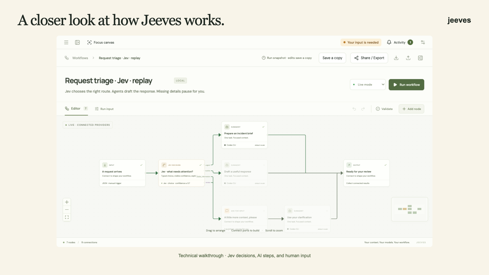

# Jeeves

### Jev needs Jeeves.

[](https://github.com/priyankark/jeeves/actions/workflows/ci.yml)
[](LICENSE)

**Even a clever model could use a butler.**

What ho! Jeeves is an open source app for productivity workflows. Jev, TypeSafe's decision model, supplies the judgment. Agents tackle the writing, research, and browser work. Jeeves keeps the steps in order and asks when a matter needs your attention.

For example, Jev can decide whether a request describes an outage, a small fix, or something that needs more detail. Jeeves sends it to the right agent or asks you a question. You can inspect the decision and reuse the workflow with the next request.

[Download Jeeves](https://github.com/priyankark/jeeves/releases) · [Quick start](docs/QUICKSTART.md) · [Watch the demo](https://www.youtube.com/watch?v=KV6YvV7WovE) · [Website](https://getjeeves.app/)

[](https://www.youtube.com/watch?v=KV6YvV7WovE)

## Keep the steps for next time

You know the routine: paste the notes, explain the task, ask for a draft, check the draft, remember what worked. Then do it all again next Tuesday.

Jeeves lets you keep that routine as a workflow you can see and change.

- **Agents do the work.** Give writing, analysis, and browser steps a clear job.
- **Jev makes the judgment.** Route a request, check the evidence, or score a draft. Inspect the answer and the route it chose.
- **You keep the final say.** Questions pause the run. Answer when you are ready. Optional sound alerts save you from watching the window.
- **Use it again.** Reuse a workflow, schedule it while Jeeves is running, or export a portable skill.

## Get Jeeves on your desktop

No Node.js, terminal, or Jeeves account needed. Choose your system from the [preview.11 release](https://github.com/priyankark/jeeves/releases/tag/v0.1.0-preview.11):

| Your computer                 | Download                                                                                                                            | Install                                   |
| ----------------------------- | ----------------------------------------------------------------------------------------------------------------------------------- | ----------------------------------------- |
| Mac, Apple Silicon (M-series) | [Apple Silicon DMG](https://github.com/priyankark/jeeves/releases/download/v0.1.0-preview.11/Jeeves-0.1.0-preview.11-mac-arm64.dmg) | Open the DMG, drag Jeeves to Applications |
| Mac, Intel                    | [Intel DMG](https://github.com/priyankark/jeeves/releases/download/v0.1.0-preview.11/Jeeves-0.1.0-preview.11-mac-x64.dmg)           | Open the DMG, drag Jeeves to Applications |
| Windows, x64                  | [Windows installer](https://github.com/priyankark/jeeves/releases/download/v0.1.0-preview.11/Jeeves-0.1.0-preview.11-win-x64.exe)   | Run the installer, then open Jeeves       |
| Linux, Debian/Ubuntu x64      | [Debian package](https://github.com/priyankark/jeeves/releases/download/v0.1.0-preview.11/Jeeves-0.1.0-preview.11-linux-amd64.deb)  | Install with your package manager         |
| Linux, x64 portable           | [AppImage](https://github.com/priyankark/jeeves/releases/download/v0.1.0-preview.11/Jeeves-0.1.0-preview.11-linux-x86_64.AppImage)  | Make executable, then open                |

This is an early preview. Mac downloads are signed and notarized by Apple. Windows installers are unsigned and may show a security warning. [Installation help, checksums, and first-run instructions](docs/QUICKSTART.md).

### Your first useful minute

1. Open Jeeves and choose **Try the example** on the welcome screen.
2. Review the project notes and select **Run demo**.
3. Read the weekly update and open **Inspect run** to see how the steps connect.

The example needs no API keys. Its output is clearly labeled as a sample. For an AI answer to your own notes, choose **Use my own notes**, connect one agent service, and switch to **Live**.

### Bring the brains

Open **Set up my AI connections** during onboarding, or **Home → Set up AI** later. Save and verify the services you want to use.

| What you want to do               | What you need                                                             |
| --------------------------------- | ------------------------------------------------------------------------- |
| Try the sample or edit a workflow | Nothing else                                                              |
| Write or analyze with agents      | One of OpenAI, Codex CLI, OpenRouter, or a local model server             |
| Add Jev decisions                 | A TypeSafe API key, plus an agent service if the workflow has agent steps |
| Run browser tasks                 | Google Chrome and the live provider selected for that browser step        |

Jev is TypeSafe's decision model. Jeeves is this app. A small difference in spelling; a useful division of labour. Hosted services have their own access requirements and costs. API credits are not included.

## Give it a proper task

| Start with                   | What happens                                                                                          |
| ---------------------------- | ----------------------------------------------------------------------------------------------------- |
| **Notes to weekly update**   | Turn project notes into a draft, check it against the notes, and review the result                    |
| **Request triage · Jev**     | Route urgent and routine requests to different agents; ask you for detail when the request is unclear |
| **GitHub maintenance**       | Read issues and pull requests, then prepare a maintainer brief                                        |
| **Grocery cart preparation** | Collect your list, budget, and preferences before opening the browser; pause for login or review      |

Find these in **Explore** or **Templates**. Each live workflow shows its required connections before you run it. Browser shopping stops for review before checkout.

## Run from source

Requires Git, Node.js **22.12 or newer**, and npm. Quit the desktop app first so the local engine port is free.

```sh
git clone https://github.com/priyankark/jeeves.git
cd jeeves
npm ci
npm run dev
```

Open **http://127.0.0.1:5173** and choose **Try the example**. No `.env` file is needed for the sample. Press **Ctrl+C** in the terminal to stop both development servers.

For a desktop window, stop the development servers and run `npm run desktop`. For a production web build, run `npm run build` followed by `npm start`, then open **http://127.0.0.1:4317**. [More setup options](docs/QUICKSTART.md#run-from-source).

## A few particulars

Workflows, settings, and history live on your computer. Cloud AI services receive the task context you send them. Saved API keys are kept in a private local settings file, not in workflow exports or browser storage. The file is not encrypted. Website sign-ins use a separate local Chrome profile.

This preview has manual updates. Schedules need the local engine to stay running. Websites can change or ask you to sign in, and generated results still need your review. See the [user guide](docs/USER_GUIDE.md) for execution details and limits.

The release passed **136 engine and integration tests, 56 browser tests, and packaged-app checks on Mac, Windows, and Linux**. These are automated checks, not a claim that every real-world task succeeds. [Verification notes](docs/ONBOARDING_VERIFICATION.md) · [Release checks](https://github.com/priyankark/jeeves/actions/workflows/release.yml)

## Join the household

Found a rough edge? [Report it](https://github.com/priyankark/jeeves/issues/new/choose). Got a useful routine? [Contribute a workflow](CONTRIBUTING.md#contribute-a-workflow). Want to improve the app? Start with the [contributor guide](CONTRIBUTING.md).

[Quick start](docs/QUICKSTART.md) · [User guide](docs/USER_GUIDE.md) · [Release guide](docs/RELEASING.md) · [Security](SECURITY.md) · [Apache 2.0 license](LICENSE)

> “I will give the matter my best consideration, sir.”
>
> Jeeves, in P. G. Wodehouse’s [_The Inimitable Jeeves_ (1923)](https://www.gutenberg.org/files/59254/59254-h/59254-h.htm).

A fine brief for a software project. Literary inspiration, with no affiliation or endorsement implied. The app and first-party starter workflows use Apache 2.0; dependencies, models, and imported skills retain their own terms.

## Help us make the first run better

Try the example, then [tell us how it went](https://github.com/priyankark/jeeves/issues/new?template=first_run.yml). We want to hear where you got stuck as well as what worked. The [first ten minutes guide](docs/FIRST_RUN_FEEDBACK.md) gives you a few things to try.

Launch materials: [current launch kit](marketing/launch/README.md). Older marketing exports are archived and should not be used for this launch.
