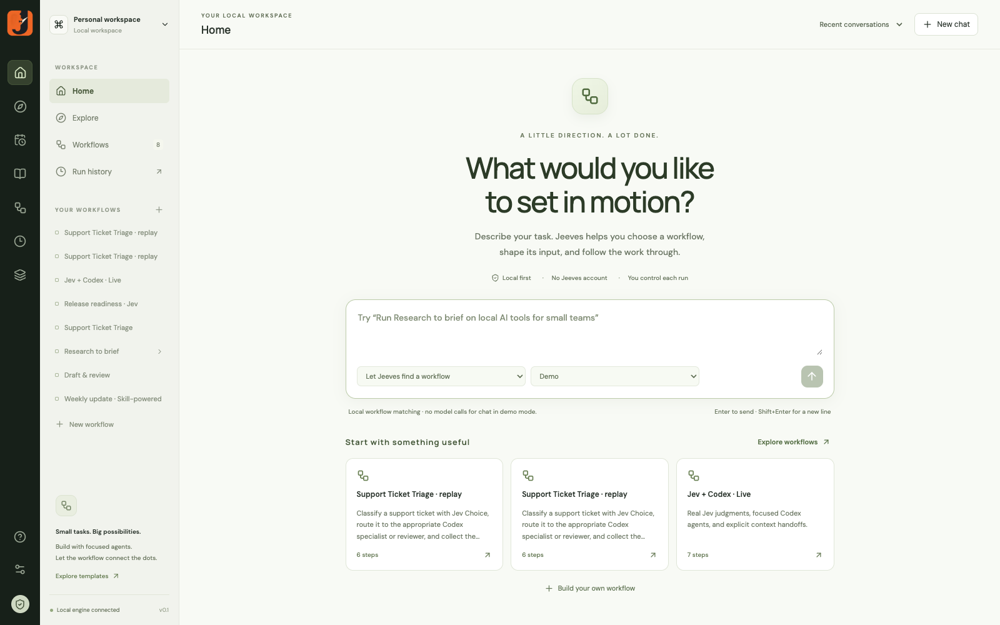

# Jeeves

A local-first, MIT-licensed desktop app for running focused agents through explicit workflows. Start in chat, inspect the graph, schedule repeat work, and take your workflows to another harness as portable skills. No Jeeves account is required.

The app includes a chat home screen, React Flow editor, Jev decisions, multi-provider agents, nested workflows, handoff files, checkpoint recovery, scheduling, skill installation, and a file-based community marketplace. Provider accounts are only needed for providers you choose; Demo mode and local workflow management work without them.



## Run

Requires Node.js 22+ and npm.

```sh
git clone https://github.com/priyankark/jeeves.git
cd jeeves
npm install
npm run dev
```

Open http://127.0.0.1:5173. Home opens in chat. Choose **Research to brief**, describe the task, review the proposed input, and select **Run demo**. Demo mode uses explicit simulated model answers while exercising real branching, execution traces, persistence, and Markdown handoffs. No keys or external model requests are needed. Fonts are bundled locally.

For a desktop window with an engine that starts automatically:

```sh
npm run desktop
```

For the production web build:

```sh
npm run build
npm start
```

Open http://127.0.0.1:4317. The desktop command builds the app, starts the local engine if needed, and opens the production UI. It reuses an existing Jeeves engine and only stops a backend it started itself. Use `npm run desktop:dev` for hot reload.

Build a standalone desktop app with `npm run package:desktop`. The current-platform distribution appears under `release/`; the Mac build is `release/Jeeves-darwin-arm64/Jeeves.app`. It bundles Electron, the UI, and the engine, so users do not need Node or npm installed to use the desktop app. Builds are currently unsigned and not notarized. The packaged Mac app stores its workspace under `~/Library/Application Support/jeeves/workspace`; source development defaults to `.jeeves/`.

## Chat home

Home is the default screen. Describe a task or choose a saved workflow. Exact names and explicit selections can be matched locally, without a model call. With Live selected and a configured provider, open-ended requests can use the assistant to select a workflow and prepare its structured input. The assistant can propose a run; only the **Run demo / Run live** button launches it.

The preview shows the workflow, providers, skill assignments, editable input, missing connections, and potential HTTP writes. During execution, chat shows progress, cancellation, and the actual output. **Inspect run** opens its trace in the editor. Repeated requests for the same proposal return the same run instead of launching it twice. Refine the task in another message to prepare another run.

Conversations are stored locally under `chats/`, reopen from **Recent conversations**, and can be deleted independently of run history. Live model assistance sends the selected task, recent messages, and workflow metadata to the selected provider. There is no hosted Jeeves chat service, telemetry, or account system.

## Workflow marketplace and contributions

**Explore** includes offline starter workflows and a connection form for public GitHub catalogs. A community repository supplies a root `jeeves-marketplace.json` manifest. Downloads are pinned to its Git commit and verified against SHA-256 digests. Review the full package, choose whether to keep or replace its agent providers, and install a new local copy. Installation remaps workflow and skill IDs and never executes the workflow.

**Share / Export** offers three formats:

- **Workflow package:** portable JSON with nested graphs and installed skill bundles.
- **Portable skill:** a standard `SKILL.md` folder containing the workflow, requirements, sample input, and a standalone Node runner.
- **Marketplace contribution:** a ZIP with the workflow package, checksummed catalog entry, a one-workflow catalog, and submission instructions.

Exports exclude connection settings, schedules, chats, and run history. Saved input values are replaced with placeholders unless explicitly included. The preview scans for known credentials and common secret patterns; authors must still review prompts, URLs, and redistribution rights for bundled skills.

Contributions are files: share a package through a channel you use, submit it to a maintainer, or publish a public GitHub catalog. Jeeves does not require a login or upload anything automatically. GitHub itself requires an account for publishing there. Connect `priyankark/jeeves` in Explore to browse this project's catalog, including the desktop-tested **Meeting notes to actions**, **Bug report triage**, and **Project status from notes** workflows. The catalog is checked into `jeeves-marketplace.json`. Bundled skills retain their own licenses and notices. See [CONTRIBUTING.md](CONTRIBUTING.md).

## Take a workflow to another harness

Export **Portable skill**, unzip it, and place the folder in your harness's skill directory. The harness must support `SKILL.md`, be able to execute Node 22.12+, and be permitted to write results and contact the configured providers. API keys alone are insufficient for workflows that require a CLI, local model server, or HTTP allowlist; the package lists those requirements.

```sh
node /path/to/skill/scripts/run.cjs --check
node /path/to/skill/scripts/run.cjs --mode demo --input input.json --output ./results
node /path/to/skill/scripts/run.cjs --mode live --input input.json --output ./results
```

The runner is bundled: no npm install, Jeeves account, or running desktop app is needed. It reads environment variables or `.env` from the invoking directory, preserves Jev routing, nested graphs, agent skills, handoffs, and checkpoints, and prints a JSON report. `--check` validates configured prerequisites and Codex login availability; it is not a live authentication test for every API. Use `--provider` and `--model` to explicitly replace agent providers. Checkpoint recovery is available through `--resume`; possibly delivered POSTs, including nested ones, require explicit `--retry-actions` after checking their destinations.

[Download a verified example skill](docs/weekly-update-skill.zip). This synthetic weekly-update workflow was executed live through Codex with the desktop app stopped and no `node_modules` directory. [Verification details](docs/PRODUCT_VERIFICATION.md).

## Jev is the decision engine

Jev is TypeSafe's System One model. The app uses the official `@typesafe-ai/sdk` to send **state + typed question** to `POST https://api.typesafe.ai/v1/systemone`. Its output selects graph edges. Text generation and coding remain separate agent tasks.

| Question   | Routing in Jeeves                                                                                                               |
| ---------- | ------------------------------------------------------------------------------------------------------------------------------- |
| **Noul**   | `p >= pass threshold` → `pass`; `p <= fail threshold` → `fail`; between them → `review`. Noul has no separate confidence field. |
| **Choice** | The selected option names the outgoing port. Below the confidence threshold → `review`.                                         |
| **Score**  | Below the confidence threshold → `review`; otherwise compare the probability-weighted rubric score to the pass threshold.       |

The inspector configures the question, JSON criteria, model, and thresholds. The run inspector shows probabilities, confidence where applicable, chosen route, actual model, latency, usage, and the raw result. Every possible Jev route must be connected. `review` is reserved for uncertainty; it can lead to a review specialist, another workflow, or an output for human inspection. There is no pause/resume human approval queue yet.

The starter asks Jev whether the research handoff has enough supported information for a brief. High probability goes to a writer; low or uncertain probability goes to a reviewer. In Demo mode, edit **Run input**:

```json
{
  "task": "Explore opportunities for open-source AI agents in small teams.",
  "demo_jev_value": 0.5
}
```

`0.9` takes the pass branch, `0.1` takes fail, and `0.5` takes review. These are test fixtures, not Jev predictions. Live mode submits the complete context to Jev and uses the returned answer. For Choice demos, this field can be an option name; node settings also expose demo confidence.

A separate **Deterministic rule** engine is available for exact comparisons. It does not call Jev.

## Connect live providers

```sh
cp .env.example .env
```

You can now connect providers directly in **Settings**. Paste a key, choose a default model, and select **Save and verify**. Settings apply immediately. The optional `.env` route above remains available and requires a server restart. Select **Live mode** to execute real tasks. New agents and templates use your configured copilot provider. Existing workflows retain their explicit provider choices.

| Integration        | Configuration                                                                                          |
| ------------------ | ------------------------------------------------------------------------------------------------------ |
| Jev                | `TYPESAFE_API_KEY`; node model defaults to `jev-latest`                                                |
| OpenAI             | `OPENAI_API_KEY`, optionally `OPENAI_MODEL`; uses Responses API with `store: false`                    |
| OpenRouter         | `OPENROUTER_API_KEY`; set `OPENROUTER_MODEL` or the exact model ID on the node                         |
| Local models       | `LOCAL_BASE_URL` and `LOCAL_MODEL`; OpenAI-compatible chat completions, e.g. Ollama / LM Studio / vLLM |
| Codex harness      | Install and log into Codex CLI, then set `ENABLE_CODEX=true`                                           |
| Direct HTTP action | Add exact origins to `ACTION_ALLOWED_ORIGINS`, separated by commas                                     |

Existing keys are never returned to the browser or included in workflow exports. Keys entered in Settings are sent to the local server and cleared from the input after saving. Connections are stored in `.jeeves/connections.json` with owner-only file permissions; `.env` is also supported. **Test connection** checks provider authentication or CLI login without generating model output. Configuration and verified connectivity have separate status labels.

This workspace is configured with a working TypeSafe key and the existing Codex CLI login. Both have been verified live. OpenAI API and OpenRouter keys remain optional and are not configured. See [live verification](docs/LIVE_VERIFICATION.md) for the measured runs.

Codex runs non-interactively with a read-only sandbox, user config ignored, explicit context over stdin, a per-node working directory, and a three-minute node timeout. Its CLI login remains available. This adapter currently supports analysis and generated output, not workspace edits. General API agents perform one text-generation request per node; they do not yet have browsing, arbitrary tools, or an agentic tool loop. The research example therefore analyzes supplied context rather than fetching web sources.

## Editor and copilot

- Drag nodes, connect their ports, and select a node to edit its configuration.
- Use **Add node** for Input, Subagent, Jev decision, Handoff, Action, Workflow, or Output.
- Delete selected nodes or connections with Backspace/Delete. Undo/redo restores nodes, connections, and configuration edits; use the toolbar or ⌘Z / ⇧⌘Z (Ctrl on other platforms). Changes during a gesture are grouped into one history step. The inspector also has node deletion and duplication.
- Workflows autosave to disk. Toolbar buttons import/export portable JSON.
- Copilot uses local starter templates in Demo mode. In Live mode it uses the chosen provider to generate a complete graph, validates it, and offers a proposal to apply. It does not execute proposed workflows automatically.
- Run history opens an immutable run snapshot as a new editable replay copy, preserving the saved workflow. Completed runs expose a readable final output with Markdown tables, copy, and download controls.
- Failed or stopped runs offer **Resume from checkpoint**, retaining completed results and continuing unfinished steps. An interrupted POST action requires an explicit confirmation because the destination may already have processed it.

## Scheduling

Open **Schedules** in the left navigation. Create a one-time run or a recurring schedule, choose Demo or Live, set its JSON input, and preview the next five occurrences. Recurring schedules use five-field cron expressions and an IANA time zone. Presets cover daily, weekday, weekly, and hourly runs; daylight-saving changes are handled in the selected zone. One-time dates are entered in your computer's local zone and saved as an absolute instant.

Schedules persist across restarts. Each stores the current graph and all referenced nested workflow definitions. Subsequent canvas edits do not change that saved snapshot; editing and saving a schedule refreshes its nested definitions, and **Replace with current canvas** refreshes the top-level graph and input. Pause, enable, edit, delete, and open the last run from its schedule card. Scheduled runs are also labeled in Run history.

The engine checks for due runs every second. It skips an occurrence when the same top-level workflow is already running. At the global four-run limit, occurrences remain pending subject to the selected missed-run policy. You can skip occurrences more than a minute late or catch up once; multiple missed intervals never create a backlog. A one-time schedule becomes finished after its occurrence is handled. Failures remain inspectable in history; there are no automatic retries of potentially delivered actions.

The scheduler saves an occurrence claim before dispatching the run. A crash between that claim and dispatch can leave a missed run requiring manual inspection; Jeeves prioritizes avoiding automatic duplicate side effects. This is a single-engine local scheduler, not a distributed or exactly-once job service.

On macOS, closing the desktop window leaves Jeeves running in the menu bar (**j.**). Reopen it from that menu; **Quit Jeeves and stop scheduling** exits its owned engine. Your computer must be awake. Jeeves does not install a login service or wake the computer. The browser version requires `npm start` to remain running.

## Skills and marketplace

Open **Skills → Marketplace** to browse public GitHub repositories. OpenAI, Anthropic, and Vercel sources are available as shortcuts; connect any public `owner/repository` containing portable `SKILL.md` packages. Search the catalog, review the actual instructions, metadata, bundled files, and source revision, then **Install reviewed version**. GitHub's unauthenticated rate limits apply; catalog results are cached briefly. Private repositories and a paid marketplace are not configured.

Installation downloads data only, pins the complete bundle to the reviewed Git commit, validates required YAML metadata, and rejects symlinks, submodules, traversal paths, oversized files/bundles, or truncated repository indexes. Limits are 150 files / 4 MB per bundle. It never executes install scripts, installs system dependencies, or grants credentials. Different revisions are separate installations, so updates require explicit selection instead of silently changing an agent.

In **Installed**, select skills shared by the workflow's copilot and all agent nodes. An agent's **Inspector → Agent skills** adds specialist assignments; nested-workflow nodes can add skills inherited by their children. Child workflow and agent assignments are combined with inherited selections. Imported graphs retain skill IDs; missing installations produce an actionable error instead of silently omitting instructions. Uninstall removes the library entry; remove remaining assignments or reinstall before starting a new run.

| Harness                           | Skill behavior                                                                                                                                                                                                           |
| --------------------------------- | ------------------------------------------------------------------------------------------------------------------------------------------------------------------------------------------------------------------------ |
| Codex CLI                         | Complete bundle materialized in the node's `.agents/skills/<name>/` folder. The prompt explicitly identifies each `SKILL.md`; references and scripts remain available within the existing read-only harness permissions. |
| OpenAI Responses                  | Selected skill instructions and text resources are included in the request instructions.                                                                                                                                 |
| OpenRouter / local compatible API | The same selected instructions and text resources are included in the system message.                                                                                                                                    |
| Workflow copilot                  | Uses the workflow-level selection through its selected harness and sees installed skill metadata when designing agents.                                                                                                  |
| Nested workflows                  | Inherit the parent's workflow and nested-node assignments, then combine their own workflow and agent selections.                                                                                                         |

API harnesses do not yet execute scripts or expose filesystem/tools; installing a skill does not add those capabilities. API text resources currently include Markdown, text, JSON, YAML, and CSV, with a 160,000-character combined budget and an explicit error on overflow. Codex reads resources on demand. Assign at most one revision of a given skill name to an agent. Runs allow up to 50 distinct bundles within a bounded snapshot size.

The runner snapshots selected bundles before execution. Checkpoint recovery keeps those exact bytes even after uninstall, and scheduled graphs retain their explicit version IDs. Demo runs show skill assignments without invoking a model. See [scheduling and skills verification](docs/AUTOMATION_VERIFICATION.md) for a real scheduled Codex run using an installed marketplace skill while the desktop window was closed.

## Execution semantics

Graphs must have one input, at least one output, no cycles, and no nodes disconnected from the input. The runner executes independent ready nodes in concurrent batches (default three, configurable through the run API from one to eight). Joins wait for their dependencies. Checkpoint writes serialize immutable snapshots so a slow write cannot overwrite newer execution state.

Each node receives `{ input, parents, previous }`: the run input, a map of directly connected active parent outputs, and either the single parent output or that map. There is no global agent conversation history. A Jev result includes the prior context alongside the decision so downstream agents can use it.

Unselected branches are skipped. A join waits for all incoming branches to finish or skip, then receives only active parents. Failed nodes abort concurrent peer work and stop the run; pending nodes become cancelled. Stop cancels provider requests and the Codex child process. Runs active during a server restart are marked interrupted and can be resumed explicitly. Completed results are reused, with their original run recorded in the trace; prompts, inputs, and the workflow snapshot stay fixed during recovery. The runner does not claim exactly-once delivery for HTTP side effects.

Handoff nodes write uniquely named Markdown files containing task and connected context. Nested workflow nodes execute a saved workflow with the caller's context as input, persist a child run, and return its output nodes. Recursive references and nesting deeper than five workflows are rejected. In a child, the original parent's task is available under `input.input`.

Direct actions support GET or POST. Empty POST bodies send connected context as JSON. URLs and JSON strings support `{{input.field}}` and `{{previous.field}}` references; URL values are encoded and exact JSON placeholders preserve their types. Named Bearer credentials are resolved at runtime from private Settings or the environment. Settings credentials are scoped to a single origin. Requests have timeouts, no redirects, a 1 MB response limit, and an origin allowlist. Connector-specific OAuth is future work.

## Local data and boundaries

Everything is stored under `.jeeves/` (gitignored):

```text
workflows/   saved workflow JSON
runs/        run snapshots, events, outputs, frozen skills and child runs
schedules/   persisted schedules and frozen workflow definitions
skills/      installed skill metadata and versioned bundles
artifacts/   Markdown handoffs and browser screenshots
browser-profiles/  separate persistent Chrome sessions per workflow step
workspaces/  Codex node working directories and final messages
chats/       local conversations, reviewed run proposals and run references
connections.json  private server-side provider settings
integrations.json private website permissions and origin-scoped API tokens
```

`JEEVES_DATA_DIR` overrides this path. The server binds to loopback and rejects foreign Origin/Host values. This is a personal local app, without multi-user authentication or a remote deployment model. Run outputs may contain the task's private data; they remain local unless you select a live provider or HTTP action.

## Verification

```sh
npm test           # runner, Jev, providers, scheduling, skill installation and inheritance
npm run build      # TypeScript + production build
npm run test:e2e   # Chrome: editing, persistence, branching, artifacts, copilot, cancellation, API boundary
```

Browser tests use installed Google Chrome and a separate temporary workspace on port 4318. Automated tests mock external providers and override local credentials to avoid making paid calls. Separate live verification has exercised Jev Noul, Choice, and Score, Codex specialists, and the live workflow copilot against authenticated accounts.

## Next milestones

1. Build a representative evaluation set and calibrate Jev questions/thresholds against real user tasks.
2. Add a durable human approval queue, connector idempotency, and transient-error retry policies.
3. Batch independent Jev questions and improve copilot latency.
4. Add writable coding-harness worktrees and tool-enabled API agents.
5. Add connector OAuth, richer nested-run navigation, signed/notarized desktop builds, and broader platform tests.

## Primary references

- [TypeSafe System One API](https://docs.typesafe.ai/api)
- [TypeSafe JavaScript SDK](https://docs.typesafe.ai/sdk/javascript)
- [Probability and confidence](https://docs.typesafe.ai/confidence)
- [Jev alongside coding agents](https://docs.typesafe.ai/introduction/coding-agents)
- [OpenAI API](https://developers.openai.com/api/docs)
- [Codex non-interactive mode](https://learn.chatgpt.com/docs/non-interactive-mode)
- [OpenRouter quickstart](https://openrouter.ai/docs/quickstart)
- [React Flow custom nodes](https://reactflow.dev/learn/customization/custom-nodes)

- [Agent Skills format](https://agentskills.io/specification)
- [cron-parser time-zone support](https://github.com/harrisiirak/cron-parser)
- [Codex skills](https://learn.chatgpt.com/docs/build-skills)

## Browser tasks and practical starters

Explore includes **GitHub maintenance** and **Grocery cart preparation**. The GitHub starter fetches up to five pages each of open issues and PRs (150 records per endpoint) and drafts a maintainer brief; it never posts or merges. It reports partial coverage when more pages remain. HTTP nodes support configurable pagination for JSON-array endpoints that return a `Link` header. Enter the repository owner/name in Home's task fields. Public GitHub reads need only `https://api.github.com` in **Settings → Websites & API access**. For a private repository, save a token there and enter its credential name in each HTTP node.

The grocery starter requires a real starting website, Google Chrome, a configured agent provider, and allowed website origins. Choose **Open workflow browser for login or review** in the browser node to sign in if needed, then close that Chrome window before running. Each browser step has its own persistent local profile. **Observe** restricts the agent to reading/scrolling and blocks non-read HTTP requests; **Interact** enables clicks and form entry. Codex receives screenshots plus page text; other providers receive page text and observed controls. Assigned skills are included in both modes.

Browser steps can select native dropdown options and set checkboxes, including quantities and substitution preferences. After a run stops, **Review browser** on Home or the run inspector reopens that step's saved session. Failed steps retain their last available screenshot for download. Close the review window before running the same browser step again.

For sign-in, choose **Use CUA to sign in** in Home's prepared workflow or the browser-step editor. The selected live provider navigates in a visible Chrome window, then hands the browser to you. Enter passwords, MFA or CAPTCHA yourself and choose **I’m signed in** to close Chrome and reuse the local session. That button records your confirmation; it does not independently verify authentication. You can cancel assistance or use the editor's manual browser option instead. CUA login does not supply API tokens to HTTP nodes. See the [login verification report](docs/CUA_SIGN_IN.md).

Browser tasks are bounded by a step limit and run timeout. They return a review result for checkout, sensitive inputs, or incomplete work. The action guards inspect visible controls and destinations; they are not a guarantee against arbitrary or malicious website behavior. Use trusted websites and review carts yourself. Real grocery retailers, CAPTCHAs, unusual widgets, and multi-domain login flows have not been validated. Browser requests, including redirects and resources, must stay on allowed origins; add required site/CDN origins explicitly in Settings.

Exports containing browser nodes include the browser driver, but require an installed Google Chrome. They do not include browser cookies, login sessions, credentials, or local browser profiles. Interrupted interactive browser steps require review before replay because a cart or website may already have changed.

## Repeatable user simulations

```sh
npm run build
npm run test:personas  # synthetic journeys, actual Chrome, no paid model calls
npm run simulate:live # synthetic GitHub/shop data, real authenticated Codex calls
npm run simulate:live:depth # quantity/substitution/session recovery and public GitHub pagination
```

These are automated persona scenarios, not a human usability study. The live simulation uses a local grocery test store and GitHub-shaped API, checks the selected products and total, and asserts that no checkout was submitted. See [simulation findings and fixes](docs/USER_SIMULATIONS.md) and [the live run evidence](docs/simulation-live-verification.json).

The [second friction pass](docs/USER_SIMULATIONS_2026-09-27.md) covers form controls, failed-run recovery, and paginated repositories, with [live verification evidence](docs/simulation-depth-live-verification.json).
