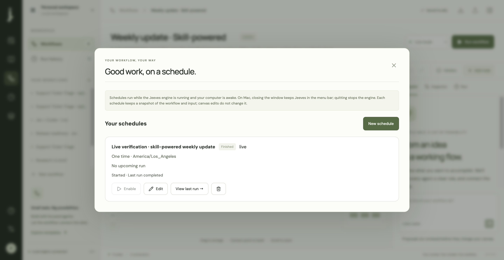
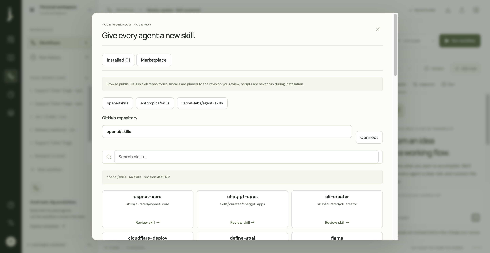
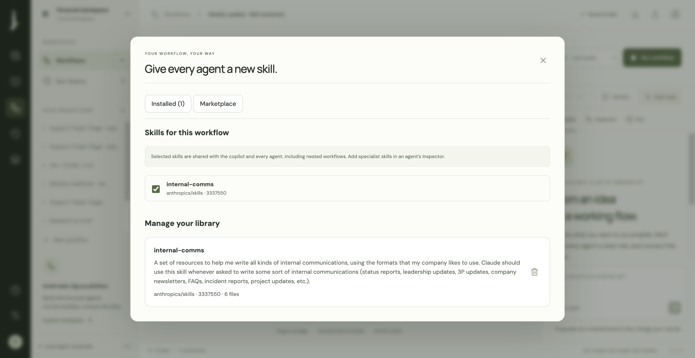

# Scheduling and skills verification

Verified September 26, 2026, on this Mac with the production Electron app and local engine.

## Delivered

- Persistent one-time and recurring schedules, five-field cron, IANA time zones, upcoming occurrence previews, pause/enable/edit/delete, and run-history links.
- Frozen top-level and nested workflow definitions, explicit missed-run policies, overlap protection, global capacity handling, and persisted occurrence claims before dispatch.
- macOS menu-bar operation: closing the window leaves the engine running; **j. → Open Jeeves** reopens it. Explicit Quit stops its owned engine.
- Public GitHub skill marketplace with OpenAI, Anthropic, and Vercel shortcuts, custom repositories, search, source and instruction previews, exact-revision installation, and uninstall.
- Workflow-wide, per-agent, and nested-workflow skill assignments. Workflow-level skills also reach the copilot. Run checkpoints retain exact installed bundle bytes.
- Codex gets a complete standard skill directory; OpenAI, OpenRouter, and local API harnesses receive selected instructions and text references. API adapters currently have no script execution or filesystem tools.

## Real scheduled skill run

Fetched real catalogs, including 44 skills in `openai/skills` and 20 in `anthropics/skills` at verification time. Installed `internal-comms` from `anthropics/skills` revision `33375500bcea98d610eb30ce10ac4e59b89c390d`, including all six files.

Created **Weekly update · Skill-powered**: input → Codex status-update specialist → output. Assigned the installed skill at workflow level. Input was explicitly synthetic engineering status data. No messages were sent or published.

Closed the desktop window before scheduling; the menu-bar engine remained available. The one-time live schedule started at 2026-09-27 00:42:59.508 UTC, 877 ms after its due time. It completed at 00:43:11.786 UTC. The Codex node took 12,263 ms and produced a synthetic update in the skill's Progress / Plans / Problems format.

- Schedule: `c74d4673-67b9-4ace-a255-706febdb7418`
- Run: `25fcc7b3-b5b8-4ba3-a711-6ea64744b53a`
- [Recorded result](scheduled-skill-run.json)

The completed schedule and workflow remain available in Jeeves. No recurring live schedule was left enabled. Reopened the actual desktop through **j. → Open Jeeves** and confirmed the installed skill remained selected.

## Automated checks

`npm run build` passes TypeScript and production compilation. Vite still reports the existing advisory about the main bundle exceeding 500 kB.

**46 unit tests pass**, including spring/fall time-zone transitions, simultaneous scheduler ticks, restart behavior, downtime policies, overlap and capacity handling, persisted dispatch failures, frozen nested workflows, skill path/metadata validation, symlink rejection, revision-pinned downloads, resource delivery to all API adapters, Codex directory materialization, nested inheritance, specialist assignment scope, and checkpoint recovery after uninstall.

**12 Chrome browser tests pass**, covering existing editor behavior plus schedule creation/preview/pause/edit/delete, actual due-time execution and history navigation, marketplace preview/install/assignment/uninstall. Browser tests use an isolated data directory, disabled live credentials, and a mocked marketplace for repeatability. Real GitHub and Codex verification above is separate.

## Operating limits

The engine must remain running and the computer awake. There is no OS login service, wake-on-schedule, or distributed scheduler. Persisting claims before dispatch avoids automatic replays but can require manual inspection after a crash in the claim/dispatch gap. External actions do not have an exactly-once delivery guarantee.

Skill installation never runs setup scripts or installs system dependencies. Private GitHub authentication is not configured. Public GitHub rate limits apply. API harness skill support covers instructions and text resources; executable tools remain a separate capability. Skill IDs are portable in workflow exports, but users must install those same revisions in a different workspace.

## Screenshots

