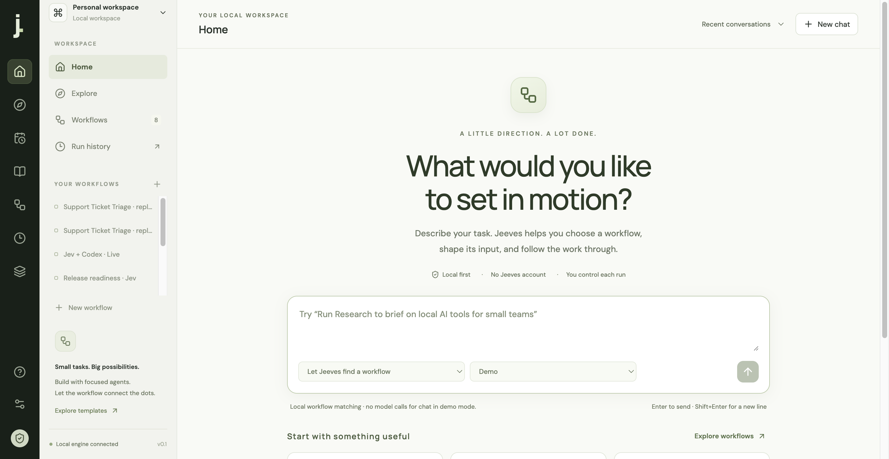
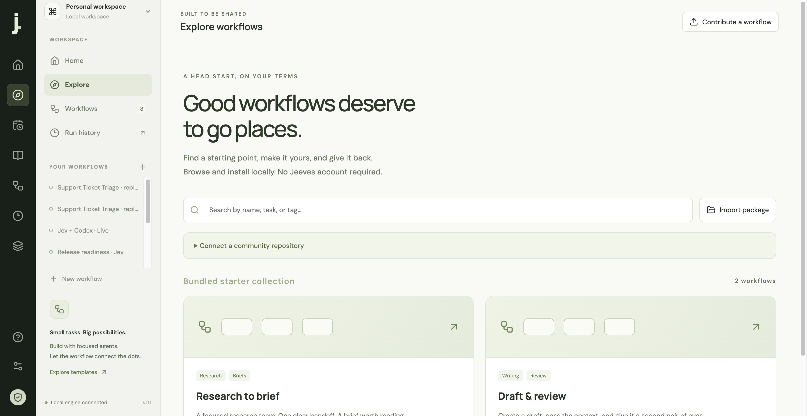
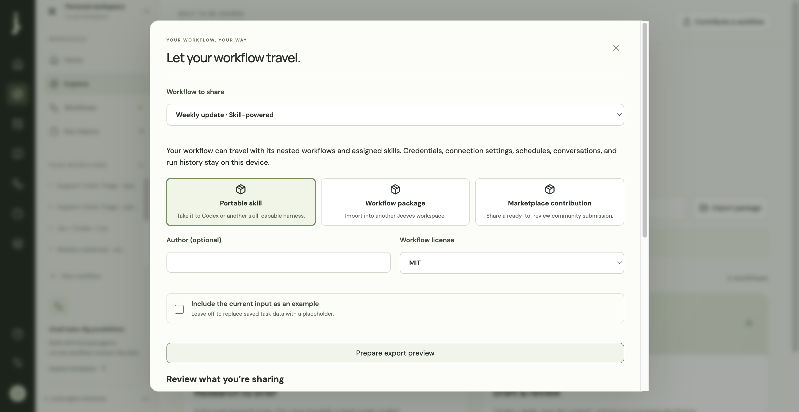

# Chat, sharing, portable skills, and desktop verification

Later browser-task and simulated-user verification: [USER_SIMULATIONS.md](USER_SIMULATIONS.md), with 67 unit/integration tests and 23 browser tests passing. The figures below describe the earlier initial-product pass.

Verified on September 26, 2026, on macOS ARM64.

## Product flow

Home is now chat. Users describe a task or select a workflow, review editable structured input and provider/action requirements, then start a Demo or Live run. Progress, cancellation, result reading, conversation history, and run inspection are connected. Repeating a launch request for the same chat proposal returns its existing run.

Explore supports bundled offline workflows, public GitHub catalogs, checksummed revision-pinned downloads, package inspection, provider adaptation, and local installation with fresh IDs. The root `jeeves-marketplace.json` contains two validated starter packages. Share offers a complete workflow JSON package, a portable skill ZIP, or a contribution ZIP with a manifest entry and submission instructions. No Jeeves account is needed. There is no hosted marketplace backend or automatically published remote repository; files and public repositories are the interchange mechanism.

The project has an MIT license, contribution guidance, a catalog checker, and a GitHub Actions checks workflow. Local validation is recorded below; the GitHub workflow has not been run on a published repository.

## Portable execution

Exported the saved **Weekly update · Skill-powered** workflow and its installed `internal-comms` skill. The ZIP includes `SKILL.md`, a self-contained Node runner, requirements, example input, workflow/nested definitions, bundled skill resources, and license notices. It contains no provider credentials or conversation/run history.

Stopped the Jeeves desktop app and confirmed the local engine was unavailable. Unpacked the export into a temporary directory with no `node_modules`. Ran it with Node and the existing authenticated Codex CLI, passing explicitly synthetic input. The run completed in **11.6 seconds** and produced the requested status update. No messages were sent or published.

- [Portable example ZIP](weekly-update-skill.zip)
- [Live result record](portable-live-verification.json)
- Run ID: `2f104a2b-d1f0-4993-9d39-6f4b7ca7012d`

A separate automated export test exercises Jev demo branching, agents, handoffs, and output in an isolated directory. Prerequisite checks fail clearly when required credentials are absent. Live portability is verified with Codex; other API adapters retain their mocked contract coverage and require their actual credentials for live use. The outer harness must allow Node execution, network access where needed, and writable result directories.

## Standalone desktop

Built `release/Jeeves-darwin-arm64/Jeeves.app`. Launched the packaged application from outside the repository with an isolated workspace. It started its bundled engine, displayed Home, and reported no browser errors. Cold start was approximately **3.7 seconds**. Renderer Node integration remained disabled.

The packaged app contains only `LICENSE`, `dist`, `electron`, `marketplace`, `package.json`, and `runtime`. It contains no project `.env`, workspace data, or `node_modules`. Its engine is bundled and uses Electron's Node runtime.

The user's existing local workspace was copied to `~/Library/Application Support/jeeves/workspace`. Existing TypeSafe and Codex configuration was applied to private local settings. The packaged app was then opened with that workspace, its configured providers verified as present, and its **Export as skill** download exercised. Original project data remains available for development.

The build is unsigned and not notarized. Windows/Linux packaging paths are available through the build script but have not been verified here.

## Tests

- TypeScript and production UI/runtime builds pass.
- **53 unit tests pass**, covering existing engine behavior plus package validation, credential exclusion, nested import remapping, standalone runner execution, chat matching/persistence, remote catalog checksums, and potentially delivered POST actions inside nested workflows.
- **15 browser tests pass**, including chat launch/reload/idempotence, marketplace preview/install without execution, skill/contribution downloads, review controls, and existing editing/scheduling/provider workflows.
- **Two repository workflow packages** pass graph/schema validation and catalog checksum verification.
- `node --check runtime/server.mjs` guards bundled-server syntax; a real packaged cold-start additionally verifies bootstrap and runtime behavior.

## UX decisions

The design applies visibility of system status, recognition over recall, user control, error prevention, and progressive disclosure: a clear Home entry point, useful starter cards, editable previews, visible Demo/Live modes, explicit external-action information, continuous run feedback, stop controls, reversible graph edits, remembered conversations, keyboard focus containment, Escape-to-close dialogs, and reduced-motion support.

These are implemented interaction principles, not a claim of completed usability research. Representative user testing, signed distribution, richer connector integrations, and a durable human-approval queue remain follow-up release work.

References: [Nielsen Norman Group usability heuristics](https://www.nngroup.com/articles/ten-usability-heuristics/), [Agent Skills specification](https://agentskills.io/specification), and [Electron distribution guidance](https://www.electronjs.org/docs/latest/tutorial/application-distribution).

