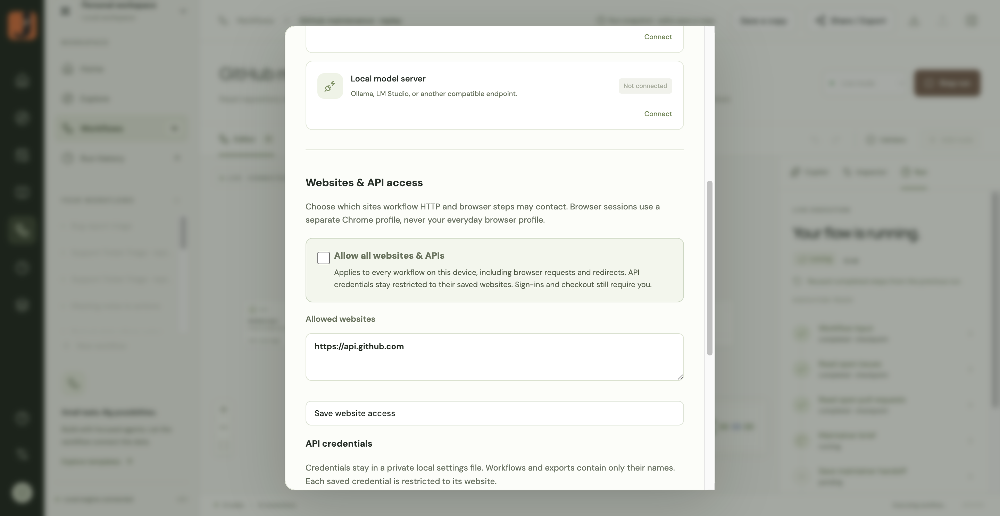

# Website access and GitHub workflow recovery

The desktop Settings dialog now includes **Allow all websites & APIs** under **Websites & API access**. It persists locally and applies to workflow HTTP requests, browser requests, redirects, and workflow preflight checks. Turning it off restores the saved list of websites. Portable runners can use `ACTION_ALLOWED_ORIGINS=*`.

Blocked runs and Home previews offer buttons to allow the required website or all websites. Granting access does not automatically replay an action. Saved API credentials remain restricted to their configured origins; provider authentication, browser interaction modes, sign-in handoffs, and checkout review are separate.

Permission errors while reopening a saved browser session also show these choices inline. After a grant, the run panel and node inspector offer **Retry from checkpoint**, CUA sign-in offers **Retry sign-in assistance**, and saved-browser review offers **Open browser again**. Five targeted browser/sign-in tests passed, including the inline checkpoint retry and saved-browser recovery. The original failed GitHub run was also checked through the installed desktop UI: both permission choices appeared beside the error, and granting the site revealed the retry button without opening Settings or launching a run automatically.

The GitHub maintenance workflow also exposed an oversized Codex input: five pages each of issues and pull requests from `nodejs/node` produced roughly 9 million characters of connected context. Large Codex context is now preserved verbatim in an owner-readable local file in the node workspace. A bounded navigation prompt instructs the agent to inspect relevant fields and pagination metadata using read-only tools. Small context continues inline. This change applies to the Codex adapter; other providers retain their own input limits.

Validation on September 27, 2026:

- All 101 unit tests passed, including permission persistence, restoring restricted access, HTTP execution, preflight, credential scoping, and lossless large-context storage.
- Both website-access browser tests passed: blocked run → allow all → successful retry → persisted setting → restore restrictions; Home preview → allow one website → successful live HTTP read.
- Type checking, production build, and macOS Apple Silicon packaging succeeded.
- Verified the permission switch and one-site recovery through the installed Electron UI.
- Resumed the original GitHub run through the desktop UI after allowing `https://api.github.com`. Run `9439e9df-6a23-427e-a6bc-42c8b150b861` completed all six steps, reusing fetched responses from the checkpoint. The brief reports 150 records over five pages per endpoint, 187 unique items after deduplication (37 issues and 150 PRs), and prominently marks coverage as partial. No GitHub writes were performed.

